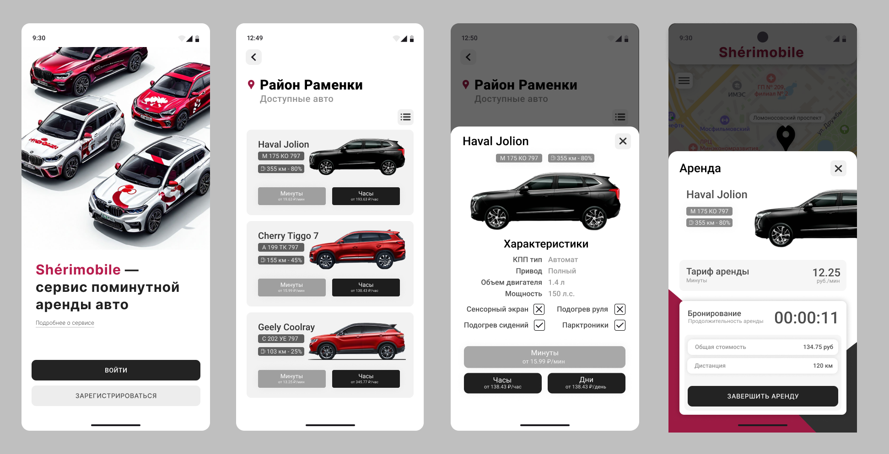

<h1 align="center">Shérimobile</h1>

<p align="center">
<a href="https://github.com/Mareanexx"></a>
<a href="https://developer.android.com/jetpack/androidx/releases/compose?hl=ru"></a>
<a href="https://www.figma.com/design/cSw6qVk30nNih7WBfNKPHg/CarSharing-Sherimobile?node-id=0-1&p=f&t=8TNPbStbmE9dfemk-0"></a>
</p>
<div align="center" width="100%">

</div>

## Описание
**Sherimobile** — это Android-приложение для каршеринга, позволяющее пользователям арендовать автомобили через удобный и интуитивно понятный интерфейс.

## Функциональность
- **Регистрация** и **аутентификация** пользователей.
- Поминутная, почасовая или подневная **аренда** автомобилей.
- Отображение доступных локаций с автомобилями **на карте**.
- Отображение **истории поездок**.
- Обращение в **поддержку** в случае неполадок.



## Технологии
Приложение разработано с использованием следующих технологий:
- **Язык**: Kotlin
- **Архитектура**: MVVM
- **UI**: Jetpack Compose
- **Навигация**: Jetpack Navigation
- **Сетевые запросы**: Retrofit + GSON
- **Асинхронная работа**: Kotlin Coroutines
- **Хранение данных**: DataStore Preferences
- **API-карт**: MapKit SDK от Yandex

## Установка и сборка
Рекомендуется использовать Android Studio Ladybug 2024.2.1. В проекте gradle version 8.9, gradle plugin version 8.7.0.

Приложение требует работу следующих микросервисов: [AuthService (сервис авторизации)](https://github.com/Mareanexx/AuthServiceCoursework), [CarSharingService (сервис операций аренды)](https://github.com/Mareanexx/CarSharingCoursework), [UserRequestsService (сервис обращений в поддержку)](https://github.com/Mareanexx/UserRequestsServiceCoursework).

1. Клонируйте репозиторий:
```
git clone https://github.com/Mareanexx/CarSharingApplication.git
```
2. Откройте проект в Android Studio.
3. Синхронизируйте зависимости с помощью Gradle.
4. Соберите и запустите приложение на эмуляторе.

